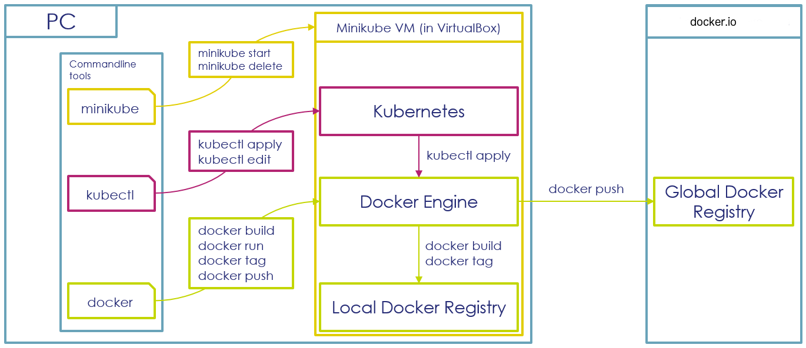

# Prerequisites (1 hour)

Please follow the instructions on this page carefully, as they will help you avoiding obstacles in the next exercices.  

The goal of the prerequisite step is to provide you a fully working development environment, containing Docker and Kubernetes.

Please install [Docker Desktop](https://www.docker.com/products/docker-desktop).
After installing, also enable Kubernetes in the settings, as it will be part of following exercises.

1. Verify that you can access the Docker CLI:  

        docker info

1. Verify that you can access the Kubernetes CLI:

        kubectl version

Below you can see an diagram of your workstation setup, which should help you understanding how the different components are interacting:  

# Alternative Setup Guide

Sometimes it can happen that Docker Desktop does not run your computer. In this case, we can try the alternative approach below:

* Install Chocolatey, a Package Manager for Windows
* With Chocolatey, you will install the following packages on your workstation:  
    * VirtualBox, a VM Manager
    * Docker CLI and Kubernetes CLI
    * Minikube, a tool that helps you installing a Docker and Kubernetes Development environment
    * Python, a programming language that you'll need later in the course
    * AWS CLI, you'll need it later in the course
* With Minikube, you will install a Virtual Machine in VirtualBox, containing Docker and Kubernetes

The diagram on the bottom of this page is designed to help you to understand how Windows, your VM, Docker and Kubernetes are interacting.

To perform this lab:

1. Install Chocolatey according to the instructions [here](https://chocolatey.org/install). You do not have to enter your email address in the first step.  

1. Launch a terminal with Windows Administrator rights and install Minikube, Kubectl (the Kubernetes CLI) and the Docker CLI with the help of Chocolatey:  

        choco install -y python virtualbox minikube kubernetes-cli docker awscli

1. Launch Minikube:  

        minikube --docker-env HTTP_PROXY="http://<isen-proxy-host>:<isen-proxy-port>" --docker-env HTTPS_PROXY="http://<isen-proxy-host>:<isen-proxy-port>" --docker-env NO_PROXY="127.0.0.1,192.168.99.0/24,10.0.0.0/8" start

    **Notes on the parameters:**  

    -   As we are in a universtiy network, we need to configure docker engine in the virtual machine to perform outgoing internet connection through this proxy.

        - Certain hosts do not need to be accessed through the proxy, which is configured through the "NO_PROXY" parameter. In our case, this is:  

            - localhost (127.0.0.1)
            - the network between your local VMs (192.168.99.0/24), 
            - the network range normally used for intranet (10.0.0.0/8)

    In order for Minikube to download the according VM image, you may have to configure the proxy on your workstation as well:  

    -   For Windows Terminal:  

            set HTTP_PROXY=http://<isen-proxy-host>:<isen-proxy-port>
            set HTTPS_PROXY=http://<isen-proxy-host>:<isen-proxy-port>
            set NO_PROXY=127.0.0.1,192.168.99.0/24,10.0.0.0/8

    - For Shell (Cygwin, Git Bash):  

            export HTTP_PROXY=http://<isen-proxy-host>:<isen-proxy-port>
            export HTTPS_PROXY=http://<isen-proxy-host>:<isen-proxy-port>
            export NO_PROXY=127.0.0.1,192.168.99.0/24,10.0.0.0/8

1. After Minikube is launched, it can be necessary to configure your Docker CLI and Kubernetes CLI on your workstation.  
   This configuration is done through environment variables, which can be set with the following commands:  
   __This has to be done every time you open a new terminal.__

    - For Windows Terminal:  

            @FOR /f "tokens=*" %i IN ('minikube docker-env') DO @%i

    - For Shell (Cygwin, Git Bash):  
    
            eval(minikube docker-env)

        or
            eval $(minikube docker-env)