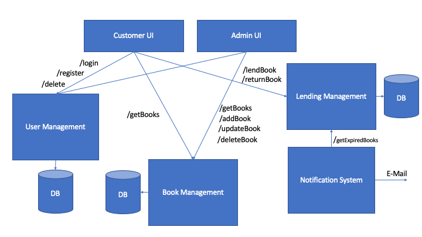

# The Project

You have been tasked to build the next-generation cloud-native library system for your university.

Your client wants you build this library system with a microservice architecture, as they cannot foresee how successful the system will be and what could be the potential load. The client would like to have the following use cases covered:

- Lifecycle Management for students who can borrow books
    - This lifecycle management system should cover registration of new users, log in functionality and removal of accounts
- Inventory system for all books available, including author, description, year of publishing
    - This system should cover creation, update and delete functionality of books
- Lending system that tracks the usage of a book by given user over time
    - This system should also ensure that a book cannot be borrowed more than once at a given time
- A notification system that retrieves books close to the defined end of lending date and notifies the user to bring the book back (via e-mail)
    - This system should run on a regular basis and also provide a status to the administrator of a book lease is expired
- A WebUI that allows users to register, log in, search for books, lend a book, see which books they have borrowed and when they need to give it back
- An admin WebUI that allows to add new books into the system and to see which books are expired
    - The administrator needs to authenticate through the lifecycle management service, but only certain users must have admin rights

These six microservices should be developed by teams of three or four students each.

Your client whishes that

- All microservices are built through an automated pipeline and pushed as Docker containers to hub.docker.com
- These Docker containers must not run as root
- All microservices have to have a unit test coverage of more than 70%
- All microservices have to be deployed in Kubernetes
- All microservices have to be indepedently scalable
- All microservices have to configurable through environment variables, e.g. connection string to a database
- Have to be well documented and contain instructions in the Readme.md on
    - How to deploy the microservice
    - How to read log files
    - How to configure it
- The Kubernetes environment in which you deploy your microservices must be properly secured and communication between microservices should be permitted only when necessary

In order to succeed, please

- Create one Github repository per microservice
- Track your requirements in Github through the opening of issues
    - You can mark an issue as resolved once the requirement is implemented and all the points above have been met
- In case you requirement something specific from another microservice team, raise an issue in Github and describe the desired functionality

